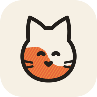
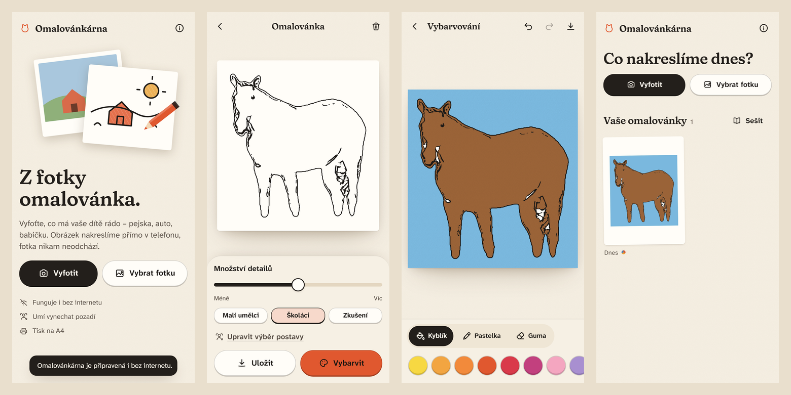

<p align="center">
  
</p>

<h1 align="center">Omalovánkárna</h1>

<p align="center">
  Z fotky omalovánka – přímo v telefonu.<br />
  Bez internetu, bez účtu, zdarma. Fotky nikam neodcházejí.
</p>

<p align="center">
  <a href="https://hukanai.github.io/omalovankarna/"><b>Otevřít aplikaci →</b></a>
</p>



## Co umí

- **Fotka → omalovánka** pomocí neuronové sítě, která se učila od ilustrátorů. Kresba vzniká
  přímo v zařízení (WebGPU, případně WebAssembly), fotka nikam neodchází.
- **Tři úrovně** – *Malí umělci* (velké plochy, silné čáry), *Školáci* a *Zkušení* –
  a posuvník množství detailů.
- **Jen hlavní postava**: klepnutím vyberete pejska, dítě nebo auto, pozadí zmizí a kresba se
  na postavu přiblíží.
- **Vybarvování v aplikaci**: kyblík (barva zateče i pod čáry, žádné bílé lemy), pastelka
  s přítlakem, guma, krok zpět, přiblížení dvěma prsty. Čáry zůstávají vždy navrchu.
- **Galerie** všech omalovánek v telefonu a **sešit** – více stránek do jednoho PDF.
- **Export**: PNG na A4 ve 300 dpi, vektorové PDF k tisku, SVG, sdílení do jiných aplikací.
- **Funguje offline** a instaluje se na plochu jako běžná aplikace. Na Androidu jde do
  Omalovánkárny poslat fotku přímo z galerie přes „Sdílet“.

## Instalace do telefonu

**Android (Chrome):** otevřete [hukanai.github.io/omalovankarna](https://hukanai.github.io/omalovankarna/)
a klepněte na **Přidat** v nabídce dole na úvodní obrazovce (nebo v menu ⋮ → *Instalovat aplikaci*).

**iPhone / iPad (Safari):** otevřete odkaz, klepněte na **Sdílet** → **Přidat na plochu** → **Přidat**.

Při prvním kreslení se stáhne kreslicí síť (17 MB), při prvním výběru postavy pomocník na
výběr (14 MB). Potom vše funguje i v letadle.

## Jak to funguje

```
fotka ─► zjednodušení (guided filter) ─► kreslicí síť ─► čištění čar ─► vektor
            │                                                ▲
            └─► SlimSAM: výběr postavy ─► ořez + maska ──────┘
```

1. **Zjednodušení fotky** hranově zachovávajícím filtrem (He et al., *Guided Image Filtering*)
   smaže textury jako srst, trávu nebo zrno, ale obrysy nechá.
2. **Kreslicí síť** *Informative Drawings* (Chan, Durand, Isola, CVPR 2022) překreslí fotku do
   linkové kresby.
3. **Kreslířské čištění**: hysterezní prahování, graf kostry čar (Zhang–Suen), odstranění
   výběžků, slabých a osamocených tahů, dotažení mezer tak, aby plochy byly uzavřené.
4. **Vektorizace**: izokřivky (marching squares) s Taubinovým vyhlazením a Catmull–Rom
   splajny – čáry si drží přirozenou tloušťku a jsou ostré v jakékoli velikosti.
5. **Výběr postavy**: *SlimSAM* (Segment Anything zmenšený na 14 MB) s automatickým odhadem
   a doladěním klepnutím.
6. **Obličeje**: detektor *YuNet* najde tváře a *MediaPipe Face Mesh* v nich 478 bodů. Z nich se
   oči, obočí, nos, rty a brada nakreslí čistými tahy ve stylu omalovánek. U hlavy z profilu se
   obličej nechá překreslit síti zvlášť v plném rozlišení.

Vše běží ve Web Workeru přes [ONNX Runtime Web](https://onnxruntime.ai/). Service worker
zajišťuje offline režim a izolaci originu, díky které může výpočet běžet ve více vláknech.

## Vývoj

```bash
npm install
npm run dev          # vývojový server
npm test             # unit testy (včetně běhu skutečných modelů)
npm run build        # produkční build do dist/
npm run test:e2e     # end-to-end testy na emulovaném Androidu a iPhonu
npm run check        # typová kontrola
```

Modely jsou součástí repozitáře (`public/models/`). Skript `npm run models` je stáhne znovu
z Hugging Face (pevné revize, ověření SHA-256). Ikony generuje `npm run icons`.

Každý push do `main` projde v GitHub Actions typovou kontrolou, unit i e2e testy a nasadí se
na GitHub Pages.

| Složka | Obsah |
|---|---|
| `src/engine/` | zpracování obrazu a vektorizace (čistý TypeScript, testovatelný v Node) |
| `src/workers/` | Web Worker s ONNX Runtime, stahování a cache modelů |
| `src/app/` | obrazovky: úvod a galerie, tvorba, vybarvování, o aplikaci |
| `src/ui/` | komponenty a design systém „papírový atelier“ |
| `src/color/` | plátno pro vybarvování |
| `src/lib/` | galerie (IndexedDB), export PNG/PDF, sdílení |

## Poděkování a licence

Kód aplikace je pod licencí [MIT](LICENSE).

- *Informative Drawings* – Caroline Chan, Frédo Durand, Phillip Isola (MIT), převod do ONNX
  [rocca/informative-drawings-line-art-onnx](https://huggingface.co/rocca/informative-drawings-line-art-onnx)
- *SlimSAM* – Zigeng Chen a kol. (Apache 2.0), ONNX [Xenova/slimsam-77-uniform](https://huggingface.co/Xenova/slimsam-77-uniform)
- *YuNet* – Wei Wu, Hanyang Peng, Shiqi Yu (MIT), [opencv/face_detection_yunet](https://huggingface.co/opencv/face_detection_yunet)
- *MediaPipe Face Mesh V2* – Google (Apache 2.0), ONNX [naklitechie/face-landmarks-onnx](https://huggingface.co/naklitechie/face-landmarks-onnx)
- *ONNX Runtime Web* – Microsoft (MIT)
- Písma *Fraunces* a *Atkinson Hyperlegible Next* (SIL Open Font License)
- Testovací fotografie z Wikimedia Commons (CC0), viz [tests/fixtures/photos/CREDITS.md](tests/fixtures/photos/CREDITS.md)
